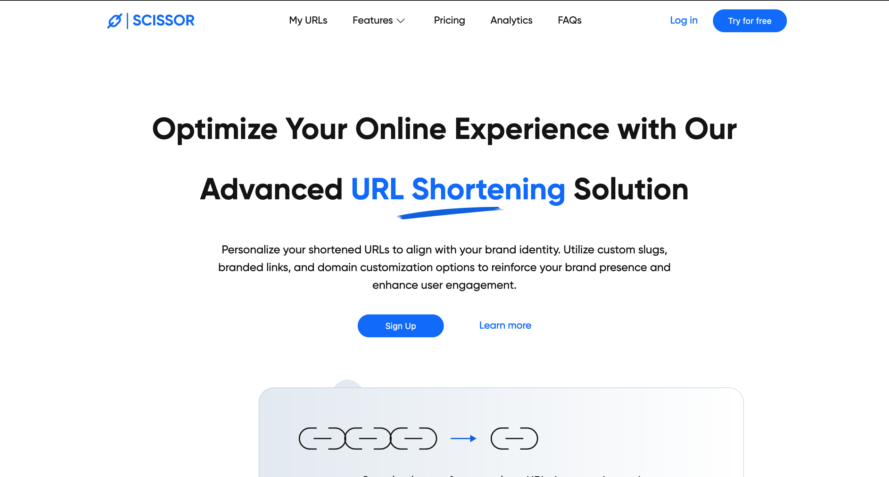
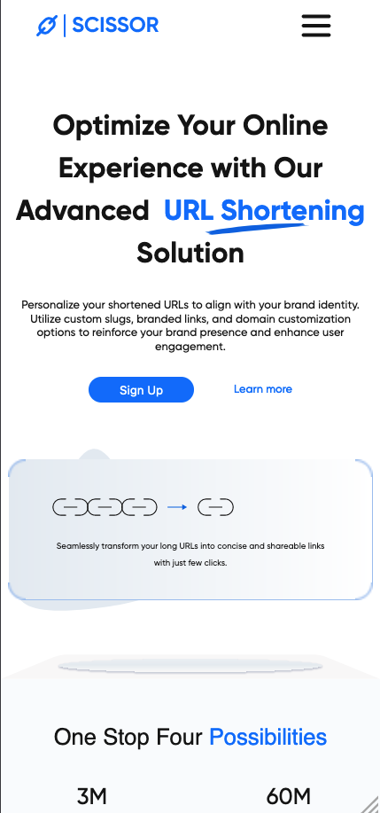
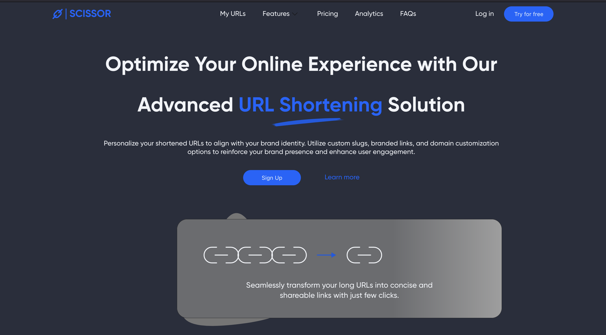

# Scissors Web | AltSchool Capstone Project

### Overview:

The Scissors Web project is a modern web application designed to simplify URL management and provide valuable insights into link performance. With its sleek user interface and powerful functionality, Scissors Web offers a seamless experience for both casual users and business professionals alike.

## Table of Contents

- [Features](#features)
- [Usage](#usage)
- [Demo](#demo)
- [Dependencies](#dependencies)
- [Get Started](#get-started)
- [Folder Structure](#folder-structure)
- [Contributing](#contributing)
- [Screenshot](#screenshot)
- [Built With](#built-with)
- [Earlier Version](#earlier-version)

## Features

#### Authentication:

- Implemented a secure authentication system to ensure user data privacy and access control.
- Users can securely log in and manage their shortened URLs within a personalized dashboard.

#### Link Shortening:

- Utilized advanced techniques, including use of emoji combinations, to provide unique and memorable shortened URLs.
- Users can effortlessly trim lengthy URLs into concise and visually appealing links, making sharing and managing links more engaging.

#### QR Code Generation:

- Integrated QR code generation functionality to allow users to generate QR codes for their shortened URLs.
- Enhances the usability of shortened URLs by enabling users to easily share and access links through QR codes, especially in mobile environments.

#### Analytics:

- Implemented analytics features to provide users with insights into the performance of their shortened URLs.
- Users can track various metrics such as click counts, browser statistics, geographical distribution... to gain valuable insights into link engagement and audience behavior.

#### Error Management:

- Error Boundaries: Implemented error boundaries to enhance application robustness and provide a graceful fallback mechanism in case of unexpected errors, without disrupting the overall functionality of the application.
- Custom 404 Page: A custom 404 page is provided to handle and gracefully display page-not-found errors, ensuring a smooth user experience even in the event of navigation to non-existent routes.

#### Theme Modes:

- Seamlessly integrates light and dark mode themes based on the user's device default settings.
- Automatically detects users preferred theme based on their device settings between light and dark modes, providing a personalized browsing experience.

#### Link Management:

- Easily organize URLs by toggling between sorting options from "Newest to Oldest" or vice versa, offering flexibility in navigating through the link collection.
- Utilize the search functionality to swiftly locate specific links by entering keywords or phrases, streamlining the retrieval process within the extensive list of URLs.

## Usage

- Try for free: Click to scroll to the Trim Url section to use application.
- Sign Up/Login: Create an account or log in to access the full range of features like custom alias, analytics...
- Reset Password: Reset account password to regain access or update password.
- Generate QR Code: Automatically generate QR code from shortened link when clicking the "trim url" or "QR Code" buttons.
- Manage Links: Organize and Sort your shortened links for easy access and management.
- View Analytics: Dive into detailed analytics to track link clicks and user engagement under myurl/stats.

## Demo

You can try the app live at [Scissors Web](https://scissorsweb.netlify.app/).

## Dependencies

- react
- react-router-dom
- react-error-boundary
- @supabase/supabase-js
- @phosphor-icons/react
- @formkit/auto-animate
- @gsap/react
- file-saver

## Get Started

To get started with Scissors Web, follow these steps:

- Clone this repository to your local machine.
- Install dependencies using "npm install".
- Start the development server with "npm start" or "npm run dev".
- Access the application at "http://localhost:3000" or your default localhost.

## Folder Structure

The project structure is organized as follows:  
public/: Contains the public assets.  
src/: Contains the source code of the application and all components  
src/components: Contains all component file.  
src/pages: Contains the Pages and their CSS styling.  
src/css: CSS styling for individual component.  
src/data: Contains data files used in some components.  
src/images: Contains images used in the App components.  
App.tsx: The main application component where routing is done.  
main.tsx: The root component file.  
package.json: Lists the project dependencies and scripts.  
index.html  
README.md/: The documentation file.  
...and others

## Contributing

Contributions are welcome! If you have any ideas, suggestions, or bug fixes, please open an issue or submit a pull request. You can follow this steps

    Fork the project.
    Create a new branch for your feature: git checkout -b feature-name.
    Make your changes and commit them: git commit -m 'Add some feature'.
    Push to the branch: git push origin feature-name.
    Submit a pull request.

## Screenshot

## Built with

- React
- Vanilla JavaScript
- TypeScript
- Semantic HTML5 markup
- CSS custom properties

## Earlier Version

Checkout earlier non-responsive design using just HTML and CSS in the  branch of this repo.
