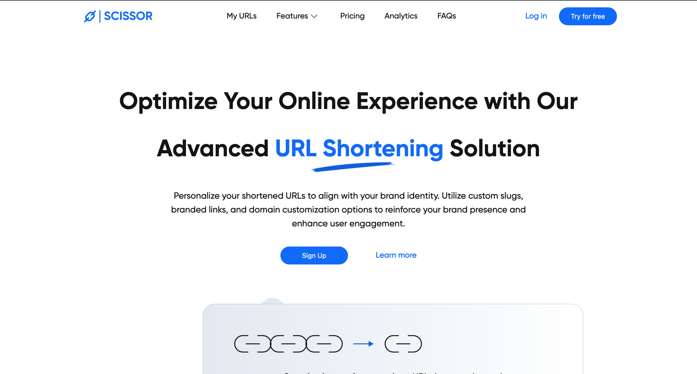
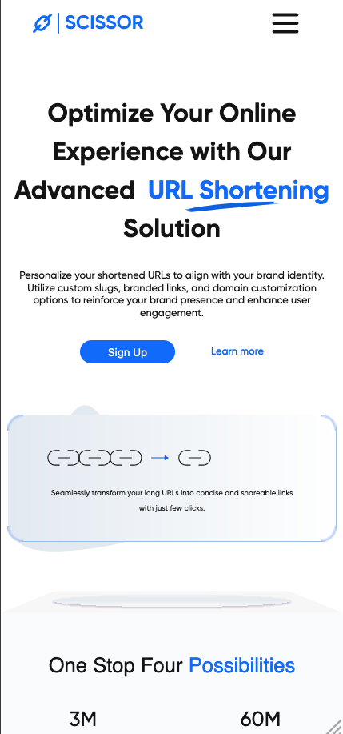
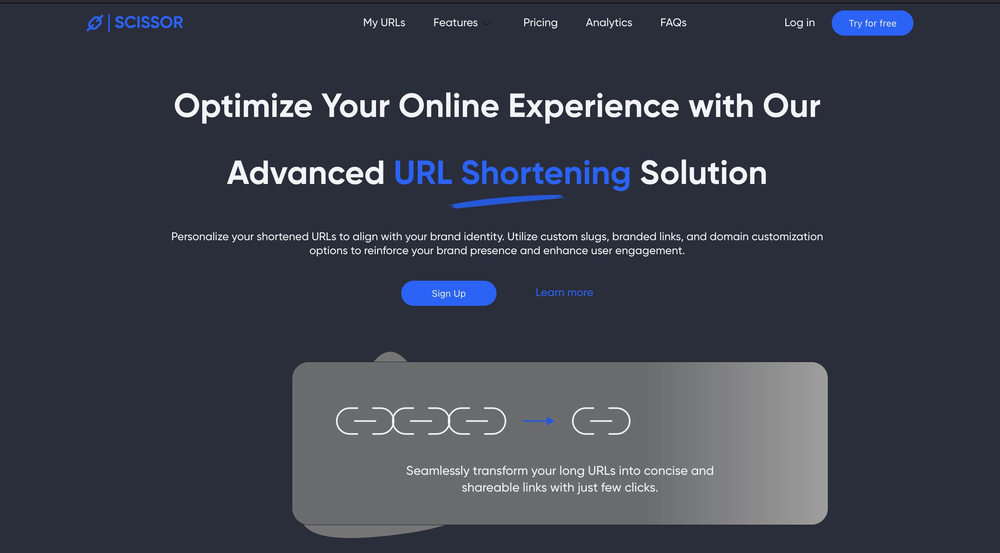

# ✂️ Scissors Web | URL Shortener, QR Code Generator & Analytics Platform

A modern, full-featured URL shortening web application built with React and TypeScript. Shorten URLs, generate QR codes, track analytics, and manage your links all in one place.

**Live Demo:** [scissorsweb.netlify.app](https://scissorsweb.netlify.app/)

---

## 🚀 Features

### 🔐 Authentication

- Secure user authentication with Supabase
- Password reset functionality
- Session management
- Protected routes and features

### 🔗 URL Shortening

- **Regular URLs**: Shorten any URL instantly
- **Emoji URLs**: Create memorable shortened links with emoji combinations
- **Custom Aliases**: Personalize your shortened URLs (requires login)
- Powered by [Spoo.me API](https://spoo.me)

### 📱 QR Code Generation

- Automatic QR code generation for shortened URLs
- Download QR codes as PNG images
- CORS-friendly implementation
- Free, unlimited QR code generation

### 📊 Analytics & Insights

- Track click counts and engagement
- View browser and device statistics
- Geographic distribution data
- Link performance metrics

### 🎨 User Experience

- **Dark/Light Mode**: Automatic theme detection based on device preferences
- **Responsive Design**: Works seamlessly on desktop, tablet, and mobile
- **Error Handling**: Comprehensive error boundaries and user-friendly error messages
- **Link Management**: Sort, search, and organize your shortened URLs
- **Custom 404 Page**: Graceful handling of page-not-found errors

---

## 📋 Prerequisites

Before you begin, ensure you have the following installed:

- **Node.js** (v16 or higher)
- **npm** or **pnpm** package manager
- A **Supabase** account (for authentication)
- A **Spoo.me** account (optional, for higher rate limits)

---

## 🛠️ Installation & Setup

### 1. Clone the Repository

```bash
git clone https://github.com/yourusername/scissorsWeb.git
cd scissorsWeb
```

### 2. Install Dependencies

```bash
npm install
# or
pnpm install
```

### 3. Environment Configuration

Create a `.env.local` file in the root directory:

```bash
cp .env.example .env.local
```

Update `.env.local` with your credentials:

```env
# Spoo.me API Configuration (Optional but recommended)
# Get your API key from https://spoo.me/dashboard → Settings → API Keys
VITE_SPOO_ME_API_KEY=spoo_your_api_key_here

# Supabase Configuration (Required)
VITE_SUPABASE_URL=your_supabase_project_url
VITE_SUPABASE_ANON_KEY=your_supabase_anon_key
```

**Note:** The Spoo.me API key is optional but recommended for higher rate limits (60/min vs 20/min).

### 4. Start Development Server

```bash
npm run dev
# or
pnpm dev
```

The application will be available at `http://localhost:5173` (or your configured port).

---

## 📚 Documentation

- **[SPOO_ME_SETUP.md](./SPOO_ME_SETUP.md)** - Complete guide for setting up Spoo.me API
- **[QR_CODE_FIX.md](./QR_CODE_FIX.md)** - QR code generation implementation details
- **[API_IMPROVEMENTS.md](./API_IMPROVEMENTS.md)** - API integration improvements

---

## 🎯 Usage

### For End Users

1. **Shorten URLs**: Paste any URL in the input field and click "Trim URL"
2. **Create Account**: Sign up to access advanced features like custom aliases and analytics
3. **Manage Links**: View all your shortened URLs in the "My URLs" section
4. **Track Performance**: Click "Stats" on any link to view detailed analytics
5. **Share & Download**: Copy links, share on social media, or download QR codes

### For Developers

- **API Integration**: Uses Spoo.me official API (v1 for regular URLs, v0 for emoji URLs)
- **Error Handling**: Comprehensive error handling with user-friendly messages
- **TypeScript**: Fully typed codebase for better development experience
- **Component Architecture**: Modular React components with clear separation of concerns
- **Context API**: Centralized state management using React Context
- **Clean Routing**: Standard React Router setup with centralized route definitions
- **Reusable Layout**: Layout component eliminates code duplication across routes

---

## 📦 Dependencies

### Core

- **react** ^18.2.0 - UI library
- **react-router-dom** ^6.22.3 - Routing
- **typescript** ^5.2.2 - Type safety

### UI & Animation

- **@phosphor-icons/react** ^2.0.15 - Icon library
- **@formkit/auto-animate** ^0.8.1 - Smooth animations
- **gsap** ^3.12.5 - Advanced animations
- **@gsap/react** ^2.1.0 - GSAP React integration

### Backend & Storage

- **@supabase/supabase-js** ^2.47.14 - Authentication & database
- **file-saver** ^2.0.5 - File downloads

### Utilities

- **react-error-boundary** ^4.0.13 - Error handling

See [package.json](./package.json) for the complete list.

---

## 📁 Project Structure

```
scissorsWeb/
├── public/                 # Static assets
├── src/
│   ├── components/         # Reusable React components
│   │   ├── Layout.tsx     # Layout wrapper (NavBar, Footer, Auth, Modal)
│   │   ├── TrimUrl.tsx    # URL shortening form
│   │   ├── UrlDetails.tsx # URL details modal
│   │   ├── Auth.tsx       # Authentication component
│   │   └── ...
│   ├── contexts/          # React Context providers
│   │   └── AuthContext.tsx # Authentication context & state management
│   ├── pages/             # Page components
│   │   ├── HomePage.tsx   # Landing page
│   │   ├── MyUrlPage.tsx  # User's URLs dashboard
│   │   └── AnalyticsPage.tsx # Analytics view
│   ├── css/               # Component stylesheets
│   ├── data/              # Static data files
│   ├── images/            # Image assets
│   ├── App.tsx            # Main app component (router setup)
│   ├── routes.tsx         # Route definitions
│   └── main.tsx           # Application entry point
├── utils/                 # Utility functions
│   └── supabase.ts        # Supabase client configuration
├── .env.example           # Environment variables template
├── .env.local            # Your local environment variables (gitignored)
└── README.md             # This file
```

### Architecture Highlights

- **Context API**: Centralized authentication state management via `AuthContext`
- **Layout Component**: Reusable wrapper eliminating code duplication
- **Route Configuration**: Centralized route definitions in `routes.tsx`
- **Separation of Concerns**: Clean separation between auth, routing, and UI logic

---

## 🔧 Available Scripts

```bash
# Start development server
npm run dev

# Build for production
npm run build

# Preview production build
npm run preview

# Run linter
npm run lint

# Run tests
npm test
```

---

## 🌐 API Integration

### Spoo.me API

- **Base URL**: `https://spoo.me/api/v1` (v1) or `https://spoo.me` (v0)
- **Authentication**: Optional API key (Bearer token)
- **Rate Limits**:
  - With API key: 60 requests/minute, 5000/day
  - Without API key: 20 requests/minute, 1000/day

### QR Code API

- **Service**: api.qrserver.com (free, CORS-enabled)
- **No API key required**
- **Unlimited usage**

---

## 🤝 Contributing

Contributions are welcome! Please follow these steps:

1. **Fork** the repository
2. **Create** a feature branch (`git checkout -b feature/amazing-feature`)
3. **Commit** your changes (`git commit -m 'Add amazing feature'`)
4. **Push** to the branch (`git push origin feature/amazing-feature`)
5. **Open** a Pull Request

### Commit Message Format

Follow conventional commits:

- `feat:` for new features
- `fix:` for bug fixes
- `docs:` for documentation changes
- `style:` for formatting changes
- `refactor:` for code refactoring

---

## 📸 Screenshots





---

## 🛠️ Built With

- **React** - UI framework with Context API for state management
- **TypeScript** - Type safety
- **React Router** - Client-side routing
- **Vite** - Build tool and dev server
- **Supabase** - Authentication & database
- **Spoo.me API** - URL shortening service
- **GSAP** - Animation library
- **CSS3** - Styling

---

## 📝 License

This project is part of the AltSchool Capstone Project.

---

## 🔗 Links

- **Live Demo**: [scissorsweb.netlify.app](https://scissorsweb.netlify.app/)
- **Spoo.me API Docs**: [docs.spoo.me](https://docs.spoo.me/)
- **Supabase Docs**: [supabase.com/docs](https://supabase.com/docs)

---

## 📧 Support

For issues, questions, or contributions, please:

- Open an issue on GitHub
- Check the documentation files in the repository
- Review the [SPOO_ME_SETUP.md](./SPOO_ME_SETUP.md) for API setup help

---

## 🙏 Acknowledgments

- [Spoo.me](https://spoo.me/) for the URL shortening API
- [Supabase](https://supabase.com/) for authentication and database
- [Phosphor Icons](https://phosphoricons.com/) for the icon library

---

## 👨‍💻 Developer

**Built by [Yero](https://lawaloyinlola.com/)**

- **Portfolio**: [lawaloyinlola.com](https://lawaloyinlola.com/)
- **GitHub**: [@lawalOyinlola](https://github.com/lawalOyinlola)

---

**Made with ❤️ for the AltSchool Capstone Project**
